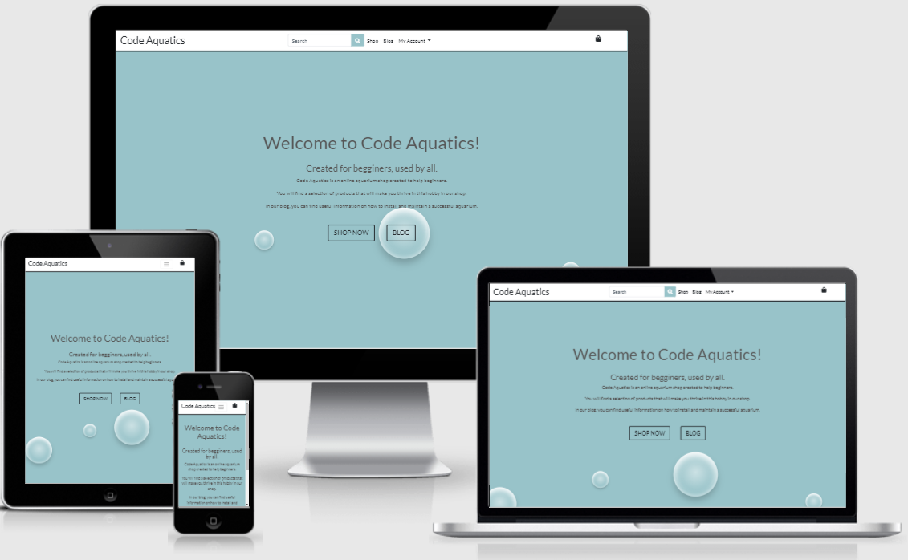

# [Code Aquatics](https://code-aquatics.herokuapp.com/)

The main purpose of this project is to create an ecommerce website where users can purchase aquarium related items. This website was made with the begginers aquarists in mind, here they can find a curated selection of products ideal for begginers and some useful information in a blog.
This website is my forth and last milestone project for the diploma in software development from the [code institute](https://codeinstitute.net). 
A live view of this website can be found here: [Code Aquatics](https://code-aquatics.herokuapp.com/).

---
## Index
* [UX](#ux)
  - [User Stories](#user-stories)
  - [Wireframes](#wireframes)
*
---
## UX

### User Stories
* As a generic user, I want a website responsive and good looking on all devices;
* As a generic user, I want a website easy to navigate;
* As a regular user, I ;
* As a regular user, I ;
* As a shopper user, I ;
* As a shopper user, I ;
* As a registered user, I ;
* As a registered user, I ;
* As a registered user, I ;
* As a registered user, I ;
* As a store owner, I want to be able to add a new blog post;
* As a store owner, I want to be able to edit any blog post;
* As a store owner, I want to be able to delete any blog post;
* As a store owner, I want to be able to add a new product;
* As a store owner, I want to be able to edit any product;
* As a store owner, I want to be able to delete any product;
* As a store owner, I ;
* As a store owner, I ;

### Wireframes
It was used [Balsamiq](https://balsamiq.com/) to create the following wireframes:
| Desktop                                                                 | Tablet and Mobile                                                       |
| ----------------------------------------------------------------------- | ----------------------------------------------------------------------- |
| [Home](readme_files/wireframes/desktop-home.png)                        | [Home](readme_files/wireframes/mobile-home.png)                         |
| [Register](readme_files/wireframes/desktop-signup.png)                  | [Register](readme_files/wireframes/mobile-signup.png)                   |
| [Log in](readme_files/wireframes/desktop-login.png)                     | [Log in](readme_files/wireframes/mobile-login.png)                      |
| [Shop](readme_files/wireframes/desktop-shop.png)                        | [Shop](readme_files/wireframes/mobile-shop.png)                         |
| [Product](readme_files/wireframes/desktop-product.png)                  | [Product](readme_files/wireframes/mobile-product.png)                   |
| [Add Product](readme_files/wireframes/desktop-add-product.png)          | [Add Product](readme_files/wireframes/mobile-add-product.png)           |
| [Profile](readme_files/wireframes/desktop-profile.png)                  | [Profile](readme_files/wireframes/mobile-profile.png)                   |
| [Bag](readme_files/wireframes/desktop-bag.png)                          | [Bag](readme_files/wireframes/mobile-bag.png)                           |
| [Checkout](readme_files/wireframes/desktop-checkout.png)                | [Checkout](readme_files/wireframes/mobile-checkout.png)                 |
| [Checkout-success](readme_files/wireframes/desktop-checkout-success.png)| [Checkout-success](readme_files/wireframes/mobile-checkout-success.png) |
| [Blog](readme_files/wireframes/desktop-blog.png)                        | [Blog](readme_files/wireframes/mobile-blog.png)                         |
| [Blog-post](readme_files/wireframes/desktop-blog-post.png)              | [Blog-post](readme_files/wireframes/mobile-blog-post.png)               |
| [Blog-add-post](readme_files/wireframes/desktop-blog-add-post.png)      | [Blog-add-post](readme_files/wireframes/mobile-blog-add-post.png)       |

---
