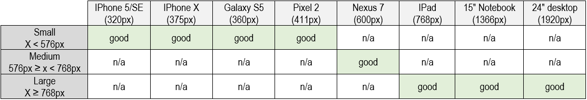

# [Code Aquatics](https://code-aquatics.herokuapp.com/) - Testing

## Index
  - [Code Validators](#code-validators)
  - [Responsiveness of the website](#responsiveness-of-the-website)
  - [Functionality of the website](#functionality-of-the-website)
  - [Browser compatibility](#browser-compatibility)
  - [Testing User Stories](#testing-user-stories)
  - [Bugs](#bugs)
---
## Code Validators
- [HTML Validator](https://validator.w3.org/):
  - HTML was checked via direct input and the only errors and warnings detected were due to the use of jinja language.
  
- [CSS Validator](https://jigsaw.w3.org/css-validator/#validate_by_input) (via direct input path):
  - CSS was checked via direct input and no errors were found.

- [JavaScript Validator](https://jshint.com/):
  - JavaScript was checked via direct input and 7 warnings due to missing semicolons were detected and amended.

- [Python PEP8 Validator](http://pep8online.com/):
  - No errors found.

## Responsiveness of the website
It was used [Chrome DevTools](https://developers.google.com/web/tools/chrome-devtools),
[Responsive Design Checker](https://www.responsivedesignchecker.com/) and some personal devices to test the responsiveness of the site.



The website structure adapts well to all used screen sizes.

## Browser compatibility
The appearance and responsiveness of the website was tested with good results in 4 different web browsers: Microsoft Edge,
Mozilla Firefox, Google Chrome and Opera.

## Testing User Stories

* As a generic user, I want a website responsive and good looking on all devices, so I can use it on all devices;
  - A generic user will find a website with a balanced design and a clear structure in whatever device he chooses to use. The test for the responsiveness with different devices can be found [here](#responsiveness-of-the-website).
* As a generic user, I want a website easy to navigate so I can find content quickly and easily;
  - A regular user will find a website with a clear structure making it easy to navigate. The header of the page contains links to the shop, the blog and the shopping bag.
* As a generic user, I want an easily register for an account so I can have a personal account;
  - A link to register for an account can be found in the header.
* As a generic user, I want to have access to a blog, so a can learn more and feel the need to return to this website to see if there is any new article;
  - A link to the blog can be found on the home page and on the header. The blog can be updated as often as the store owner wants.
* As a generic user, I want to be able to contact Code Aquatics;
  - An email contact is provided in the footer of the website.
* As a generic user, I want to be able to know more about Code Aquatics;
  - A generic user can easily navigate to the code aquatics social media accounts throughout the links available on the footer.

* As a shopper user, I want to be able to view the list of available products so that I can select some to purchase;
  - A link to the shop can be found on the home page, at the header and on the blog posts. This link directs the user to a page where all products are displayed.
* As a shopper user, I want to be able to search for a product so that I can find it;
  - A search bar, searching for matching words in the product's name and description, can be found in the header.
* As a shopper user, I want to be able to sort the products by name, price and category so that I can easily identify the best for me;
  - Users can sort the products based on price from low to high or from high to low.
  - Users can sort the products based on their name.
  - Users can sort the products based on the category's name.
  - Users can choose to see only products from one category.
* As a shopper user, I want to be able to view individual product details such as price, description and rating so that I can decide if that's the product I want to buy;
  - On the products, the user can see the price, name, rating and image of the product. If more information is required, the user can open the product's detail page, where a description is shown.
* As a shopper user, I want to view the total of my purchase at any time so that I can avoid spending too much;
  - A bag icon is present on the top right side of the page ( in the header). If the user has anything in the shopping bag, the total cost is displayed below the shopping bag icon.
* As a shopper user, I want to easily view the items in my bag so that I can check if I have everything I want;
  - Using the shopping bag icon the user can access the shopping bag and check which products are on the shopping bag.
* As a shopper user, I want to adjust the items in my bag before the checkout so that I can easily make changes before checking out;
  - On the shopping bag page the user can remove products or adjust the quantity.
* As a shopper user, I want the payment to feel secure, safe and easy so that I can have confidence in this website and a peaceful experience;
  - Consumers can pay with a credit card and the payment goes via Stripe payments.
  - Stripe webhooks are implemented for extra secure payments.
* As a shopper user, I want to view an order confirmation after checking out so that I can verify I didn't make any mistakes;
  - An order confirmation is displayed after the checking out is completed.
* As a shopper user, I want to receive an email confirmation after checking out so that I can keep records of my purchases;
  - An email with the order number, order date, order cost and delivery address is sent after the checking out is completed.

* As a registered user, I want to receive an email confirmation after registering so that I can verify that my account registration was successful;
  - After registration, an email is sent to confirm the account registration.
* As a registered user, I want to easily recover my password so that I can recover access to my account;
  - A "forgot password?" link is presented on the log in page. The user can easily recover the password if needed.
* As a registered user, I want to easily log in and log out so that I can access my account;
  - Links to log in and log out are always present inside the header's "My account" dropdown menu.
* As a registered user, I want to have a personalized user profile so that I can view my details and my order history;
  - Inside the header's "My account" dropdown menu there's a link to "my profile" page, where the user can access the order history and delivery information

* As a store owner, I want to be able to add a new blog post so that I can make the blog session always fresh and interesting;
  - The store owner can add new blog posts using the "add new post" link displayed on the blog's page. This link directs the user to a page with a form where the user can add a new blog post. This page can only be accessed by superusers.
* As a store owner, I want to be able to edit any blog post so that I can amend or add information to a post;
  - A link to edit the blog post is displayed on the blog post page and on every blog post card inside the blog page. Using this link, the superuser will be directed to a page with a pre-filled form where the user can edit the post.
* As a store owner, I want to be able to delete any blog post if I feel that there is no need to have that post anymore;
  - A link to delete the blog post is displayed on the blog post page and on every blog post card inside the blog page. Using this link, the superuser can delete the blog post. When this option is chosen, a modal will appear to make sure that this is not an unintentional action.
* As a store owner, I want to be able to add a new product so that I can add new products to my store;
  - The store owner can add a new product using the "add post" link displayed on the header's "My account" dropdown menu. This link directs the user to a page with a form where the user can add a new product. This page can only be accessed by superusers.
* As a store owner, I want to be able to edit any product so that I can change the products' characteristics;
  - A link to edit the product is displayed on the product's page and on every product's card inside the products page. Using this link, the superuser will be directed to a page with a pre-filled form where the user can edit the product.
* As a store owner, I want to be able to delete any product so that I can remove items that are no longer for sale;
  - A link to delete the product is displayed on the product's page and on every product's card inside the products page. Using this link, the superuser can delete the product. When this option is chosen, a modal will appear to make sure that this is not an unintentional action.


## Bugs
- On the bag page there was a bug allowing the user to put non integer numbers when adjusting the bag.
  - This bug was solved by adding some javascript that shows an alert message if the user tries to adjust the quantity to a non integer number.
- On the checkout page there was a box asking if the user wanted to save the delivery address. The bug was that the new delivery address was always saved, even when this box was left unchecked. The box used was similar to the one used on the boutique ado project, and I had the same bug on the boutique ado project. I spend some time trying to fix this bug with the help of a tutor. We inserted some print messages inside my code and checked that the check box was working fine, but didn't understand why was it still saving the information.
  - I decided to apply the KISS principle and removed the box. I want to understand why this is happening, unfortunately I don't have time to do it before I finish this project, but it's something I'm planning to do soon.
- My Rating system wasn't showing the correct amount of stars.
  - This bug was due to an error in the code, I was using ```>``` instead of ```>=```, therefore it was missing a star when the rating value was an integer.
- The toast message container wasn't showing properly on smaller screens.
  - This bug was solved using a media query, changing the message container max-width to 90% on smaller screens.